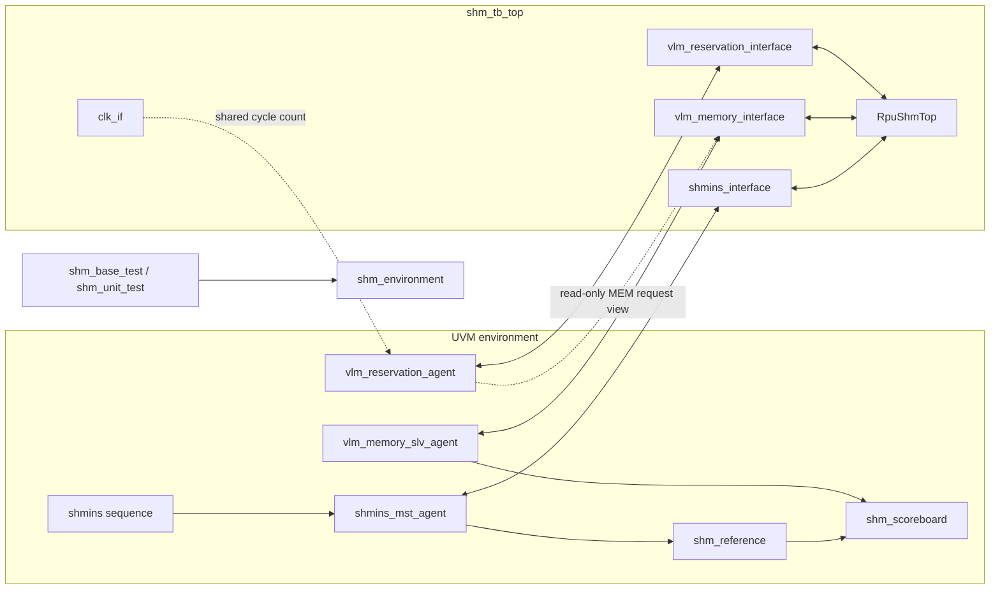

# ut_shm 验证环境总体架构

本文说明 ut_shm testbench 的静态层次、interface、配置传递、TLM 连接和 UVM phase
分工。阅读前建议先了解 [DUT 概览](../spec/dut-overview.md)；端口行为仍以
[creq/ack 接口](../spec/creq-ack-interface.md)和
[MEM/VLM 接口](../spec/mem-vlm-interface.md)为准，本文只描述验证环境如何接入这些
端口。

## 1. 总体结构

`shm_tb_top` 同时实例化 DUT、三条业务 interface 和一个共享计周期 interface。
UVM 环境通过 virtual interface 访问这些信号，不使用层次路径直接读写 DUT 端口。



环境按职责分成三条相互配合的数据路径：

- shmins 路径产生 creq、观察 ack，并把已接受的 creq 送入 reference；
- MEM 路径观察实际读写请求、维护 DUT 侧 memory 状态，并返回读数据；
- reservation 路径驱动 busy，同时检查预约请求与实际 MEM 请求的周期对应关系。

Reference 和 scoreboard 位于 ut_shm 专用环境中。三个 agent 位于 `ver_common/uvc/`
下，可以由其他验证环境复用。

## 2. tb top 与 interface

[`shm_tb_top.sv`](../../../ut_shm/tb/shm_tb_top.sv) 是仿真顶层。它完成以下工作：

1. 生成 1 ns 周期的 `clk`；
2. 将 `rst_n` 保持为 0，经过 10 个上升沿后释放；
3. 用 `shm_util_package` 中的参数实例化 `RpuShmTop`；
4. 把 DUT 端口连接到对应 interface；
5. 调用 `run_test()` 启动 UVM。

|tb top 实例|Interface|连接范围|验证侧用途|
|---|---|---|---|
|`shmins_intf`|`shmins_interface`|`creq_*`、`vack_*`、`mack_*`|master driver 驱动 creq，monitor 观察 creq、release 和 ack|
|`vlm_memory_intf`|`vlm_memory_interface`|`mem_r*`、`mem_w*`|monitor 观察实际 MEM 请求，slave driver 驱动 `mem_rdata`|
|`vlm_reservation_intf`|`vlm_reservation_interface`|`vlm_r*`、`vlm_w*`|reservation agent 观察预约并驱动 read/write busy|
|`clock_intf`|`clk_if`|共享 `clk`|为周期敏感组件提供单调递增的 `cycle_count`|

`clk_if.cycle_count` 不受 `rst_n` 清零，用于把 reservation、busy 和实际 MEM 请求
标到同一个全局周期。业务复位仍由三条业务 interface 上的 `rst_n` 表示。

当前工作树已在 `shmins_interface` 和 `shm_tb_top` 中添加阶段 2 规范要求的
`creq_tmsk`，但 driver、monitor 和 reference 尚未贯通该字段。这个局部接线还不能
视为功能已经实现，也不改变 [creq/ack 接口规范](../spec/creq-ack-interface.md)中的要求。

## 3. UVM hierarchy

`shm_base_test` 创建实例名为 `shm_env` 的 `shm_environment`。默认 active 配置下，
运行时层次如下：

```text
uvm_test_top
└── shm_env : shm_environment
    ├── shmins_mst_agt : shmins_mst_agent
    │   ├── sequencer
    │   ├── driver
    │   └── monitor
    ├── vlm_memory_slv_agt : vlm_memory_slv_agent
    │   ├── sequencer
    │   ├── driver
    │   └── monitor
    ├── vlm_reservation_agt : vlm_reservation_agent
    │   ├── monitor
    │   ├── reservation_checker
    │   ├── coverage
    │   └── scheduler
    ├── shm_ref : shm_reference
    └── shm_scb : shm_scoreboard
```

`shm_environment` 总是创建三个 agent。`shmins_mst_agent` 和
`vlm_memory_slv_agent` 根据各自 config 决定是否创建 active driver/sequencer 和
monitor；当前 `vlm_reservation_agent` 固定为 active-only，并始终创建 monitor、
checker、coverage 和 scheduler。

`shm_ref` 与 `shm_scb` 只在 `shm_environment_config.shm_is_active == UVM_ACTIVE`
时创建。该开关控制 ut_shm 专用 reference/scoreboard 路径，不等同于各 agent 的
active/passive 设置。

## 4. Config DB 传递

顶层 include 的 [`shm_ut_connect.svh`](../../../ut_shm/tb/shm_ut_connect.svh) 先把
四个 virtual interface 以通配路径写入 Config DB。Test 创建并初始化
`shm_environment_config`，再把它交给 `shm_environment`。Environment 负责校验依赖、
细分 agent config，并把所需 interface 传给子组件。

|设置者|实例匹配|字段名|类型|主要消费者|
|---|---|---|---|---|
|`shm_tb_top`|`*`|`shmins_vif`|`virtual shmins_interface`|`shm_environment`、shmins agent|
|`shm_tb_top`|`*`|`memory_vif`|`virtual vlm_memory_interface`|`shm_environment`、memory agent|
|`shm_tb_top`|`*`|`reservation_vif`|`virtual vlm_reservation_interface`|`shm_environment`|
|`shm_tb_top`|`*`|`clk_vif`|`virtual clk_if`|reservation 周期敏感组件|
|`shm_base_test`|`shm_env`|`shm_environment_config`|`shm_environment_config`|`shm_environment`|
|`shm_environment`|`shmins_mst_agt`|`cfg`|`shmins_mst_agent_config`|shmins agent|
|`shm_environment`|`vlm_memory_slv_agt`|`cfg`|`vlm_memory_slv_agent_config`|memory agent|
|`shm_environment`|`vlm_reservation_agt`|`cfg`|`vlm_reservation_agent_config`|reservation agent|
|`shm_environment`|`shm_ref`、`shm_scb`|`shm_environment_config`|`shm_environment_config`|reference、scoreboard|

Reservation agent 的 `reservation_vif` 和 `memory_vif` 存在
`vlm_reservation_agent_config` 中；monitor 由 agent 直接调用 `set_config()` 获得这两个
handle。Checker、monitor 和 scheduler 通过 Config DB 取得同一个 `clk_vif`。

Config DB 字段名是环境连接契约。修改名称或实例路径时，必须同步检查设置者、获取者
和 wildcard 的覆盖范围。

## 5. TLM 与直接调用连接

`shm_environment.connect_phase()` 建立跨组件连接。当前只有写数据比对和 MEM 读服务
进入 scoreboard；reservation agent 保持独立。

|源|连接类型|目标|传递内容|
|---|---|---|---|
|`shmins_mst_agt.monitor.shmins_analysis_port`|analysis port → analysis imp|`shm_ref.shmins_analysis_export`|采样后的 `shmins_sequence_item`|
|`shm_ref.wdata_ass_arr_port`|analysis port → analysis FIFO|`shm_scb.ref_wrvlm_analysis_export`|`shm_wtrans_item` 期望 byte map|
|`vlm_memory_slv_agt.monitor.write_analysis_port`|analysis port → analysis FIFO|`shm_scb.rtl_wrvlm_analysis_export`|实际 MEM write transaction|
|`vlm_memory_slv_agt.driver.mem_port`|blocking transport port → imp|`shm_scb.mem_imp`|MEM read request，并在同一 transaction 中返回数据|

`vlm_memory_monitor.read_analysis_port` 当前没有连接到其他组件。MEM read 返回数据由
slave driver 经 blocking transport 从 scoreboard 获取，不经过该 analysis port。

Reservation agent 不通过 TLM 与 reference 或 scoreboard 连接。它在每个采样周期内
同步取得 reservation/MEM 地址快照，然后按 checker、coverage、scheduler 的顺序
直接调用，最后驱动下一周期 busy。具体内部状态和检查算法见
[VLM reservation agent](components/vlm-reservation-agent.md)。

## 6. UVM phase 分工

|Phase|当前环境中的主要动作|
|---|---|
|time 0 / `run_test` 前后|tb top 发布 virtual interface、产生 clock/reset，并启动 UVM test|
|`build_phase`|test 创建 environment/config；environment 获取 interface 和配置、创建 agent/reference/scoreboard；agent 创建启用的子组件|
|`connect_phase`|agent 连接 driver/sequencer 并分配 virtual interface；environment 建立跨组件 TLM 连接|
|`configure_phase`|`shm_reference.ref_banks` 和 `shm_scoreboard.rtl_banks` 使用相同策略初始化|
|`main_phase`|test 启动 shmins sequence；driver/monitor 在 reset 释放后工作；scoreboard 并行收集与比对；reservation agent 逐周期响应|
|`check_phase`|scoreboard 检查 FIFO 和期望写集合是否仍有未消费内容|
|`report_phase`|base test 根据 UVM error/fatal 数量打印 case pass/fail|
|`final_phase`|需要文件输出的 monitor 关闭 debug 文件|

当前大多数组件在启动时等待初始 reset 释放，但尚未形成统一的“运行中复位”状态清理
机制。DUT 的复位契约已经由 spec 定义，各组件需要取消的 pending 状态见组件文档，
跨组件缺口统一记录为 [`ENV-001`](../verification-status.md#env-001-运行中-reset-状态清理)。

## 7. Package 与编译依赖

根 `Makefile` 依次把 `shm_dut.f`、`shm_environment.f` 和 `shm_tbtop.f` 交给 VCS。
具体命令和环境变量将在构建指南中维护；本文只记录影响 class 可见性的依赖关系。

环境 filelist 和 tb top filelist 按以下顺序建立可见性；相邻项不一定存在直接 import，
但后面的 compilation unit 可以依赖前面已经声明的 package、interface 或 class：

```text
Synopsys VIP packages
    → collection
    → shm_util_package
    → interfaces
    → shm_seq_item_package
    → shm_seq_package
    → shm_env_package
    → shm_test_package
    → shm_tb_top
```

|Package|主要内容|
|---|---|
|`collection`|scoreboard 使用的关联数组、set 和 queue 工具|
|`shm_util_package`|共享参数、`bit_rt_range`、字符串工具|
|`shm_seq_item_package`|shmins/MEM transaction、enum field、`vlm2aa`|
|`shm_seq_package`|shmins master 和 unit sequence|
|`shm_env_package`|三个 agent、environment config、reference、scoreboard、environment|
|`shm_test_package`|`shm_base_test`、`shm_unit_test`|

Interface 文件在依赖它们的 class package 之前单独编译。Synopsys VIP 的
`svt_uvm_pkg`、`svt_mem_uvm_pkg` 也必须先于 `shm_env_package` 可见。`.svh` class
文件由对应 package include，不作为独立 compilation unit 重复加入 filelist。
