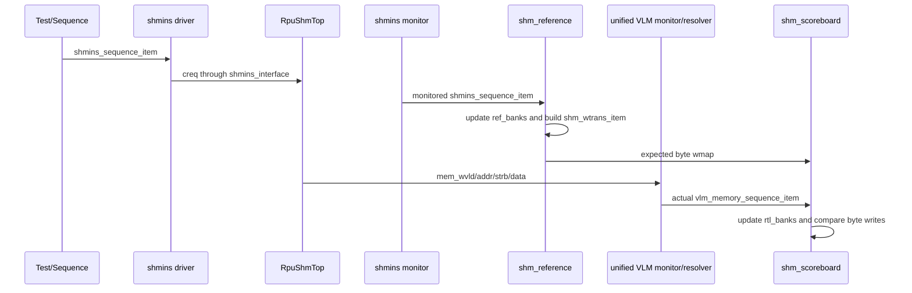
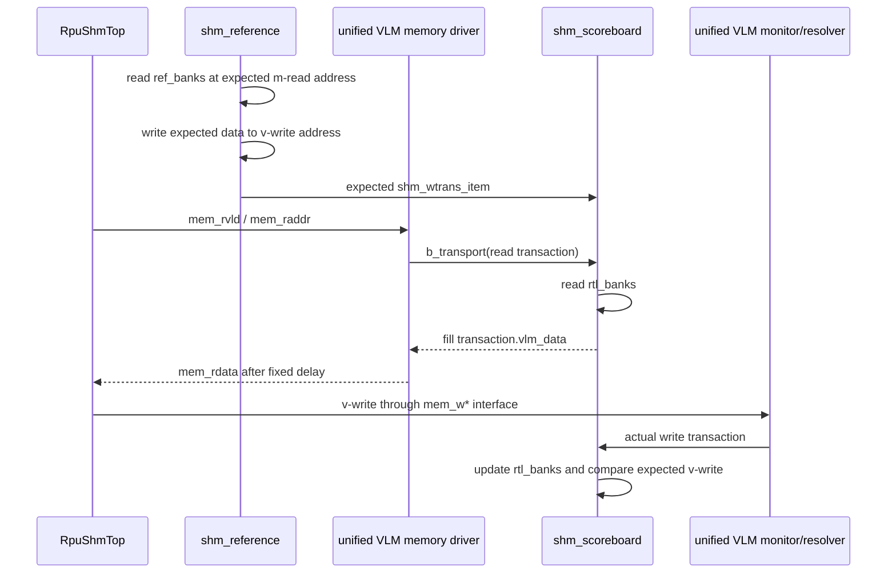

# ut_shm 数据流与数据模型

本文在[环境总体架构](architecture.md)的连接关系之上，说明 transaction、byte map
和两份 memory 状态由谁创建、修改和消费，并沿 V2M、M2V、reservation 三条路径追踪
数据。组件内部的匹配算法、错误边界和开发 contract 见[组件文档](components/index.md)。

## 1. 共享数据模型

### 1.1 `shmins_sequence_item`

`shmins_sequence_item` 是 creq 的 transaction 表示，同时服务于激励和监测：

- sequence 随机化枚举字段、地址字段、每线程 length/mask/offset/data 等输入；
- driver 调用 `item_to_rtl()` 把枚举字段编码进 20-bit `creq_typ`，再驱动 interface；
- monitor 从 interface 创建新的 transaction，并调用 `rtl_to_item()` 解码
  `creq_typ`，同时添加 accepted cycle、transaction UID 和 reset epoch，供 reference
  与 lifecycle checker 使用；
- 地址辅助字段 `offs_elem`、`elem_cnt_max` 和 helper function 用于约束及 reference
  计算，不是独立 DUT 端口。

地址 helper 使用两层模型：LOC/WRP/BLK 把 MADDR 转换为
`shm_logical_addr_t{bank_id, warp_id, laddr}`，公共物理映射再转换为
`shm_physical_addr_t{bank_id, gid, baddr}`。M2V 的 `creq_vaddr` 宽度为 `BADDR_W`，由
sequence 根据逻辑写回起点编码为 gid 内 BADDR。

阶段 2 新增的 `creq_tmsk` 使用 `THD_N` bit packed vector 表示。Driver 把它驱动到
interface，monitor 采样并检查 X/Z 和全零值，transaction copy 保留该字段；reference
只为严格等于 1 的 thread 建立派生地址和数据期望。

### 1.2 `shm_wtrans_item`

`shm_wtrans_item` 继承 `shmins_sequence_item`，保留原始 creq 上下文，并加入 reference
计算结果：

|字段|含义|
|---|---|
|`issue_cycle`|monitor 接受 creq 的共享 clock cycle，供 outstanding 超时诊断使用|
|`baddr_2d_array`|每个 thread/element 映射后的 BADDR；第一维在当前实现中按 thread index 使用|
|`bid_2d_array`|每个 thread/element 映射后的 BANK ID；第一维在当前实现中按 thread index 使用|
|`gid_2d_array`|每个 thread/element 映射后的低/高物理 BANK ID|
|`logical_addr_2d_array`|可选诊断字段，保存 bank、绝对 warp 和 WARP 内 laddr|
|`wstrb_2d_array`|每个 element 的有效 byte；第一维在当前实现中按 thread index 使用|
|`wmap`|按 bank、gid 和 byte address 索引的期望写值|

`wmap` 的逻辑类型是 `byte wmap[BANK_N][GID_N][baddr_t]`：前两维选择物理
`<bank_id, gid>`，关联数组 key 是完整 byte BADDR，value 是一个 byte。它统一表示
普通 V2M 写入和 M2V 写回，因此
scoreboard 不需要假设 DUT 会把一笔 creq 拆成多少个 32-Byte MEM beat。

### 1.3 `vlm_memory_sequence_item`

`vlm_memory_sequence_item` 是一次采样中所有 BANK 的 MEM transaction 快照：

|字段|含义|
|---|---|
|`vlm_read`|1 表示 read，0 表示 write|
|`vlm_bken[BANK_N]`|本次快照中有效的 BANK|
|`vlm_addr[BANK_N]`|各 BANK 的完整 BADDR|
|`vlm_gid[BANK_N]`|从唯一到期 reservation record 恢复的 gid|
|`vlm_gid_valid[BANK_N]`|该 MEM event 是否具有唯一可解释的 gid|
|`reservation_matched[BANK_N]`|due cycle 和完整地址是否均匹配|
|`vlm_data[BANK_N]`|各 BANK 的 32-Byte data|
|`vlm_strb[BANK_N]`|各 BANK 的 32-bit byte strobe|

统一 VLM monitor 为实际 MEM 请求创建原始对象，agent/resolver 在 scheduler 的
pre-update 状态中补全 gid 和 match status 后才发布。Memory slave driver 也使用同一
类型向 scoreboard 请求读数据；只有唯一匹配的 request 才允许进入可信 memory model。

### 1.4 Reservation 周期快照

Reservation 路径不复用 `vlm_memory_sequence_item`，而是使用
`vlm_reservation_cycle_transaction_t` 表示一个周期的原子快照。该 struct 包含：

- 全局 `cycle`；
- read/write `[delay][gid][sub_bank]` busy 二态快照；
- 每 BANK 的 read reservation 和两个 write reservation nullable handle；
- 每 BANK 的实际 MEM read/write nullable handle；
- monitor 是否发现四态输入错误的 `input_error`。

`vlm_rsv_req` 保存完整地址、gid 和 issue delay，原始 `vlm_mem_req` 只保存实际 MEM
地址。Scheduler 为已经接受的预约另建带 gid 的 `vlm_shm_record_t`，checker 结果使用
`vlm_reservation_check_result_t` 汇总。它们只在 reservation agent 内部通过同步函数
调用传递，不进入 environment 级 TLM 网络。

### 1.5 Transaction lifecycle event

Lifecycle 路径使用两个只读 UVM object：

- `shmins_ack_event`：由 shmins monitor 创建，保存方向、ID、cycle 和 reset epoch；
- `shm_completion_event`：由 scoreboard 创建，保存 transaction UID、cycle，以及
  `OBSERVED`（全部 byte 实际匹配）或 `RESOLVED`（允许包含被覆盖 byte）分类。

`shm_transaction_lifecycle_checker` 把它们与 monitor 发布的 accepted
`shmins_sequence_item` 关联。Monitor 不决定 ack 是否预期；scoreboard 不决定 ack
方向或 ID；lifecycle checker 不参与 byte 数据比较。Checker 按 accepted UID 为 V2M 和
M2V 分别维护 ordered lifecycle queue；年轻事务的 ack grace 只有在它成为本方向队头后
才启动，另一方向的慢事务不会形成阻塞。

## 2. 对象所有权与修改规则

|数据|创建者|允许修改者|消费者|
|---|---|---|---|
|激励 `shmins_sequence_item`|shmins sequence|sequence、driver 编码/分配 ID|shmins driver|
|监测 `shmins_sequence_item`|shmins monitor|发布前由 monitor 填充；发布后视为只读|shm reference、lifecycle checker|
|`shm_wtrans_item`|shm reference|发布前由 reference 填充；发布后视为只读|shm scoreboard|
|`shmins_ack_event`|shmins monitor|发布前由 monitor 填充；发布后只读|lifecycle checker|
|`shm_completion_event`|shm scoreboard|发布前由 scoreboard 填充；发布后只读|lifecycle checker|
|监测 `vlm_memory_sequence_item`|统一 VLM monitor + resolver|monitor 填原始 payload，resolver 填 gid/match；发布后只读|shm scoreboard 或其他订阅者|
|读服务 `vlm_memory_sequence_item`|VLM memory driver|driver 填 request；scoreboard 填 `vlm_data`|原 driver|
|reservation cycle transaction|统一 VLM monitor|monitor 创建 request handle；下游只读|checker、resolver、coverage、scheduler|
|scheduler record|reservation scheduler|scheduler|checker、coverage、scheduler|

UVM analysis port 传递的是 object handle，不自动建立“接收者可任意修改”的所有权。
当前连接依赖发布者在 `write()` 后不再修改对象、订阅者把对象当成不可变快照。需要在
多个消费者中产生可修改版本时，应显式 clone，而不是修改共享 handle。

## 3. V2M 数据流

普通 V2M 和 VTRANS 在环境级使用同一条数据流，差异由 reference 根据 creq 类型解释。



Reference 从监测到的 creq 计算期望 `<bank_id, gid, BADDR, byte value>`，立即更新
`ref_banks`，并发布一笔 `shm_wtrans_item`。DUT 可以把同一 creq 拆成多周期、多 BANK
的 MEM write；统一 monitor/resolver 按实际接口周期发布带 gid transaction，scoreboard 再按
strobe 展开为 byte write，与期望 byte map 对照。

这个数据流只要求最终 byte 写入可匹配，不用 creq ID 强行绑定某一笔 MEM beat。
Outstanding 覆盖、覆盖写和超时的具体处理属于 scoreboard 组件算法。

## 4. M2V 数据流

M2V 同时使用 reference memory 和 DUT 侧实际 memory：前者预测最终 v-write，后者为
DUT 的 m-read 提供数据。



Reference 在收到 creq 时，从自己的 `ref_banks[bank][gid]` 读取期望 m-read 数据，再按
已经编码为 gid 内 BADDR 的 `creq_vaddr` 生成期望 v-write，并把结果仍表示为
`shm_wtrans_item.wmap`。实际读路径由统一 VLM agent 观察 `mem_rvld/mem_raddr`，先从唯一
到期 record 恢复 gid，再通过 `b_transport` 请求 scoreboard 读取
`rtl_banks[bank][gid]`，然后在固定延迟后驱动 `mem_rdata`。DUT 随后产生的 v-write 与其他
MEM write 一样由 monitor 送入 scoreboard。

当前 `b_transport()` 在接到 read transaction 时立即读取 `rtl_banks`。它尚未实现
[MEM/VLM 接口](../spec/mem-vlm-interface.md#24-ffd_cyc-写可见窗口)要求的
`FFD_CYC` 截止周期快照；这是 memory model 的已知实现缺口。

## 5. 两份 memory 状态

Reference 与 scoreboard 各自持有一组 `svt_mem`，每个 `<bank_id,gid>` 对应一个 byte-wide
model。二者使用相同的地址范围和初始化策略，但推进时机不同。

|状态|所有者|按什么事件更新|服务对象|
|---|---|---|---|
|`ref_banks[BANK_N][GID_N]`|`shm_reference`|监测到 creq 后，按 reference 预测顺序读写|生成 V2M/M2V 的期望 byte map|
|`rtl_banks[BANK_N][GID_N]`|`shm_scoreboard`|统一 monitor 发布匹配的实际 MEM write 后更新|向 memory driver 提供 DUT 实际可见的 read data|

两份状态不能合并。Outstanding 或 DUT 调度改变请求先后时，reference 已经预测的状态
与实际 MEM 已完成状态可能暂时不同；共享一份 memory 会把预测结果提前暴露给 DUT，
也会掩盖实际写入缺失或乱序问题。

两组 memory 都在 `configure_phase` 使用 `svt_mem::INCR` 初始化，并为 BANK `i` 传入
相同的 `i << 4` 初始化参数。测试依赖两边初始内容一致；修改初始化方法时必须同时修改
reference 和 scoreboard，或抽取成一份共享初始化策略。

## 6. Reservation 数据流

统一 VLM agent 原子观察 reservation 请求和 MEM request，并主动驱动 busy、组织 MEM
read response。Reservation checker 不访问 reference 期望；只有已经由唯一到期 record
补全 gid 的 memory transaction 才进入 `rtl_banks` 和 scoreboard 数据路径。

```text
unified VLM interface
                │
                ▼
vlm_monitor.collect_cycle()
                │ cycle transaction
                ▼
checker → mem_resolver → publish MEM transaction
        → coverage → scheduler → drive next busy
```

Monitor 等待 `rst_n===1` 后，在同一采样边界取得全部 VLM/MEM 状态，并把 X/Z 检查
限制在该边界。Agent 保证 checker、resolver 和 coverage 先看到产生当前 observed busy
的 scheduler 状态，再让 scheduler 推进窗口。Resolver 按
`<direction, bank_id, due_cycle>` 找到唯一 record，比较完整地址，并把 record gid 写入
memory transaction。该顺序不依赖 analysis FIFO 或不同 UVM 线程的回调先后。

Reservation 到实际 MEM 的匹配键和 busy 规则由
[MEM/VLM 接口规范](../spec/mem-vlm-interface.md)定义；scheduler/checker 的内部数据结构
见 [VLM reservation agent](components/vlm-reservation-agent.md)。

## 7. Reset 与当前实现边界

这里描述的是当前数据通路，不表示所有 DUT spec 都已实现。当前需要在后续组件修改中
处理的边界包括：

- `creq_tmsk` 数据链已经贯通；全零 sample 由 monitor 报告后丢弃，inactive payload X/Z
  组件测试已通过，稀疏 mask、DUT 输出抑制和 VTRANS 全 mask 的28个 cell 也已随最新
  `shmins_mask_directed.lst` 通过真实 RTL；inactive/masked don’t-care X utility、reference
  过滤、组件矩阵和30笔系统 test已实现并通过空design编译，正式design运行及coverage待完成；
- MEM read 服务尚未按 `FFD_CYC` 建立截止周期快照；
- 各组件能避开初始 reset 期间的采样，但运行中 reset 对 reference item、scoreboard
  outstanding、memory read response 和 reservation scheduler state 的清理尚未统一；
- reservation agent 不执行 alignment policy，并继续检查 reservation 与 MEM 完整地址
  相等；下游 SRAM 支持非对齐 32-Byte beat，scoreboard 也不需要来源相关 alignment；
- SPACE_BLK 的 MADDR 已改为 group-relative 编码；公共映射用
  `creq_wpid/creq_wpnum` 选择 `warp_group`；全部 13 个 interleave size 的独立公式测试
  和实际 RTL BLK regression 已通过。
- memory/reservation 已合并为统一 VLM interface/agent，memory model 已包含 gid；剩余
  定向验证顺序见[开发计划](../../development/shm-dual-bank-interface-refactor-plan.md)。

这些条目是实现状态，不会覆盖 DUT spec。唯一问题 ID、优先级和验收方法见
[验证实现状态](../verification-status.md)，组件算法见[组件文档](components/index.md)。
